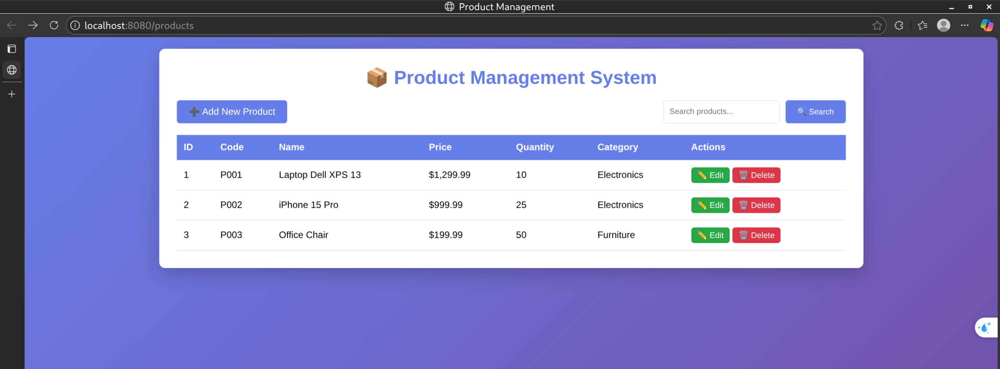
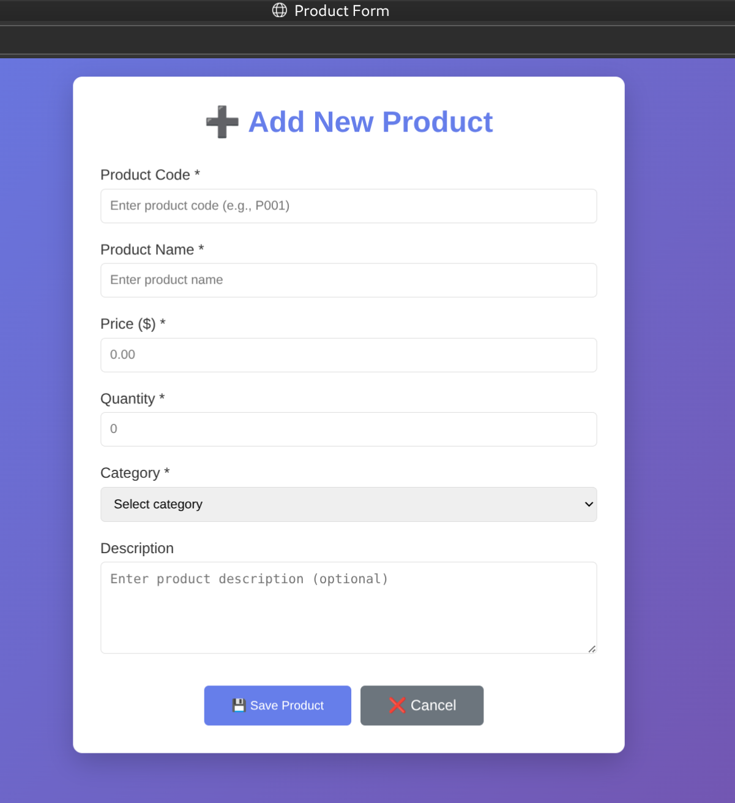
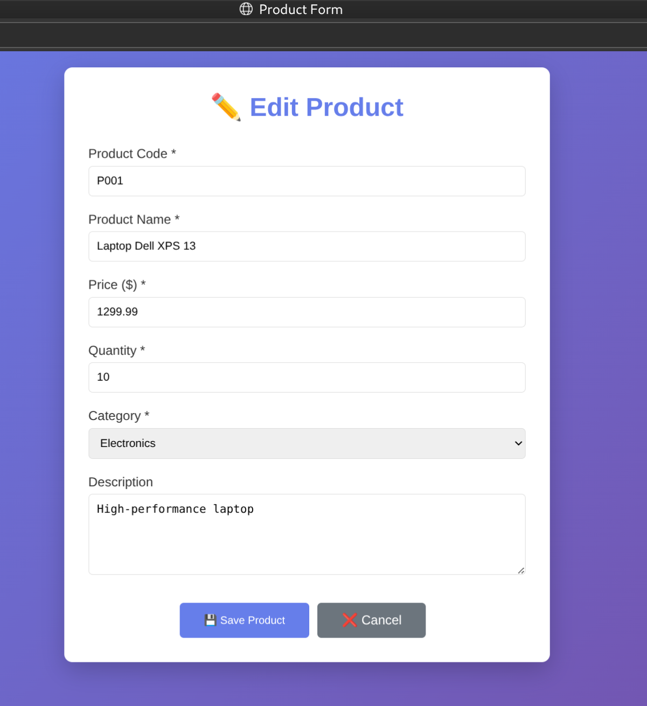

# Lab 7: Spring Boot & JPA CRUD - In-Class Exercises Report

**Course:** Web Application Development
**Student Name:** Mai Long Thiên
**Date:** 29/11/2025

---

## Exercise 1: Project Setup & Configuration (15 points)

### Task 1.1: Create Spring Boot Project (5 points)

**Requirements:**
*   Spring Boot: 3.3.x (latest stable)
*   Language: Java
*   Group Id: com.example
*   Artifact Id: product-management
*   Dependencies: Spring Web, Spring Data JPA, MySQL Driver, Thymeleaf

**Code/Configuration:**
*Project created using Spring Initializr with the specified dependencies.*

**Evaluation Criteria:**

| Criteria | Points |
| :--- | :--- |
| Project created with correct structure | 2 |
| All dependencies added | 2 |
| Project opens without errors | 1 |

**Explanation:**
*   **Project Structure**: The project follows the standard Maven directory layout (`src/main/java`, `src/main/resources`).
*   **Dependencies**:
    *   `spring-boot-starter-web`: For building web applications, including RESTful, applications using Spring MVC.
    *   `spring-boot-starter-data-jpa`: For Spring Data JPA and Hibernate support.
    *   `mysql-connector-j`: JDBC driver for MySQL connectivity.
    *   `spring-boot-starter-thymeleaf`: For server-side template rendering.

**Screenshot:**

---

### Task 1.2: Database Setup (5 points)

**Requirements:**
*   Create `product_management` database.
*   Create `products` table with columns: `id`, `product_code`, `name`, `price`, `quantity`, `category`, `description`, `created_at`.
*   Insert sample data.

**SQL Script (`init.sql`):**
```sql
CREATE DATABASE IF NOT EXISTS product_management;
USE product_management;

CREATE TABLE IF NOT EXISTS products (
    id BIGINT PRIMARY KEY AUTO_INCREMENT,
    product_code VARCHAR(20) UNIQUE NOT NULL,
    name VARCHAR(100) NOT NULL,
    price DECIMAL(10,2) NOT NULL,
    quantity INT DEFAULT 0,
    category VARCHAR(50),
    description TEXT,
    created_at TIMESTAMP DEFAULT CURRENT_TIMESTAMP
);

INSERT INTO products (product_code, name, price, quantity, category, description) VALUES
('P001', 'Laptop Dell XPS 13', 1299.99, 10, 'Electronics', 'High-performance laptop'),
('P002', 'iPhone 15 Pro', 999.99, 25, 'Electronics', 'Latest iPhone'),
('P003', 'Samsung Galaxy S24', 899.99, 20, 'Electronics', 'Flagship Android'),
('P004', 'Office Chair', 199.99, 50, 'Furniture', 'Ergonomic chair'),
('P005', 'Standing Desk', 399.99, 15, 'Furniture', 'Adjustable desk');
```

**Evaluation Criteria:**

| Criteria | Points |
| :--- | :--- |
| Database created | 2 |
| Table structure correct | 2 |
| Sample data inserted | 1 |

**Explanation:**
*   **Database Creation**: The script ensures the database exists before trying to use it.
*   **Table Schema**: The `products` table is defined with appropriate data types (`DECIMAL` for price, `VARCHAR` for strings) and constraints (`PRIMARY KEY`, `UNIQUE`, `NOT NULL`).
*   **Sample Data**: Initial data is inserted to verify the application's read functionality immediately upon startup.

---

### Task 1.3: Configure application.properties (5 points)

**File:** `src/main/resources/application.properties`

**Requirements:**
*   Configure server port.
*   Configure database connection (URL, username, password).
*   Configure JPA/Hibernate settings (ddl-auto, show-sql, dialect).
*   Configure Thymeleaf settings.

**Code:**
```properties
spring.application.name=product-management
server.port=8080

# Database Configuration
spring.datasource.url=jdbc:mysql://localhost:3307/product_management?useSSL=false&allowPublicKeyRetrieval=true
spring.datasource.username=root
spring.datasource.password=your_password
spring.datasource.driver-class-name=com.mysql.cj.jdbc.Driver

# JPA/Hibernate Configuration
spring.jpa.hibernate.ddl-auto=update
spring.jpa.show-sql=true
spring.jpa.properties.hibernate.format_sql=true
spring.jpa.properties.hibernate.dialect=org.hibernate.dialect.MySQLDialect

# Thymeleaf Configuration
spring.thymeleaf.cache=false
spring.thymeleaf.prefix=classpath:/templates/
spring.thymeleaf.suffix=.html
```

**Evaluation Criteria:**

| Criteria | Points |
| :--- | :--- |
| Database connection configured | 2 |
| JPA properties set correctly | 2 |
| Application runs without errors | 1 |

**Explanation:**
*   **Datasource**: Configured to connect to the MySQL database running on port 3307 (mapped via Docker). `useSSL=false` and `allowPublicKeyRetrieval=true` are used for easier local development.
*   **JPA Settings**: `ddl-auto=update` allows Hibernate to update the schema if the entity changes. `show-sql` enables logging of SQL statements for debugging.
*   **Thymeleaf**: Cache is disabled (`false`) to allow hot-reloading of templates during development.

---

## Exercise 2: Entity & Repository Layers (20 points)

### Task 2.1: Create Product Entity (10 points)

**File:** `src/main/java/com/example/productmanagement/entity/Product.java`

**Requirements:**
*   Add proper JPA annotations (`@Entity`, `@Table`, `@Id`, etc.).
*   All fields with appropriate types (`BigDecimal` for price).
*   Add lifecycle callback for `createdAt`.
*   Generate getters, setters, constructors.

**Code:**
```java
package com.example.productmanagement.entity;

import jakarta.persistence.*;
import java.math.BigDecimal;
import java.time.LocalDateTime;

@Entity
@Table(name = "products")
public class Product {

    @Id
    @GeneratedValue(strategy = GenerationType.IDENTITY)
    private Long id;

    @Column(name = "product_code", unique = true, nullable = false, length = 20)
    private String productCode;

    @Column(nullable = false, length = 100)
    private String name;

    @Column(nullable = false, precision = 10, scale = 2)
    private BigDecimal price;

    @Column(nullable = false)
    private Integer quantity;

    @Column(length = 50)
    private String category;

    @Column(columnDefinition = "TEXT")
    private String description;

    @Column(name = "created_at", updatable = false)
    private LocalDateTime createdAt;

    public Product() {
    }

    public Product(String productCode, String name, BigDecimal price, Integer quantity, String category, String description) {
        this.productCode = productCode;
        this.name = name;
        this.price = price;
        this.quantity = quantity;
        this.category = category;
        this.description = description;
    }

    @PrePersist
    protected void onCreate() {
        this.createdAt = LocalDateTime.now();
    }

    // Getters and Setters omitted for brevity
    // ...
}
```

**Evaluation Criteria:**

| Criteria | Points |
| :--- | :--- |
| All JPA annotations correct | 3 |
| Proper data types used | 2 |
| Constructors implemented | 2 |
| Getters/setters complete | 2 |
| @PrePersist lifecycle callback | 1 |

**Explanation:**
*   **JPA Annotations**: `@Entity` marks the class as a persistent Java class. `@Table` specifies the table name. `@Id` and `@GeneratedValue` define the primary key strategy.
*   **Data Types**: `BigDecimal` is used for `price` to ensure precision for monetary values. `LocalDateTime` is used for the timestamp.
*   **Lifecycle Callback**: `@PrePersist` ensures that `createdAt` is automatically populated with the current timestamp before the entity is first saved to the database.

---

### Task 2.2: Create Product Repository (5 points)

**File:** `src/main/java/com/example/productmanagement/repository/ProductRepository.java`

**Requirements:**
*   Interface extends `JpaRepository`.
*   Add `@Repository` annotation.
*   Add custom query methods.

**Code:**
```java
package com.example.productmanagement.repository;

import com.example.productmanagement.entity.Product;
import org.springframework.data.jpa.repository.JpaRepository;
import org.springframework.stereotype.Repository;

import java.util.List;

@Repository
public interface ProductRepository extends JpaRepository<Product, Long> {

    List<Product> findByCategory(String category);

    List<Product> findByNameContaining(String keyword);

    boolean existsByProductCode(String productCode);
}
```

**Evaluation Criteria:**

| Criteria | Points |
| :--- | :--- |
| Extends JpaRepository correctly | 2 |
| Custom query methods correct | 2 |
| Method naming conventions followed | 1 |

**Explanation:**
*   **JpaRepository**: Extending this interface provides standard CRUD operations (save, findAll, findById, deleteById) without writing any implementation code.
*   **Query Methods**: Spring Data JPA automatically derives the query from the method name:
    *   `findByCategory`: Generates `SELECT ... WHERE category = ?`.
    *   `findByNameContaining`: Generates `SELECT ... WHERE name LIKE %?%`.

---

## Exercise 3: Service Layer (10 points)

### Task 3.1 & 3.2: Implement Service (10 points)

**File:** `src/main/java/com/example/productmanagement/service/ProductServiceImpl.java`

**Requirements:**
*   Create Service interface and implementation.
*   Add `@Service` and `@Transactional` annotations.
*   Inject `ProductRepository` using constructor injection.
*   Implement all CRUD methods.

**Code:**
```java
package com.example.productmanagement.service;

import com.example.productmanagement.entity.Product;
import com.example.productmanagement.repository.ProductRepository;
import org.springframework.beans.factory.annotation.Autowired;
import org.springframework.stereotype.Service;
import org.springframework.transaction.annotation.Transactional;

import java.util.List;
import java.util.Optional;

@Service
@Transactional
public class ProductServiceImpl implements ProductService {

    private final ProductRepository productRepository;

    @Autowired
    public ProductServiceImpl(ProductRepository productRepository) {
        this.productRepository = productRepository;
    }

    @Override
    public List<Product> getAllProducts() {
        return productRepository.findAll();
    }

    @Override
    public Optional<Product> getProductById(Long id) {
        return productRepository.findById(id);
    }

    @Override
    public Product saveProduct(Product product) {
        return productRepository.save(product);
    }

    @Override
    public void deleteProduct(Long id) {
        productRepository.deleteById(id);
    }

    @Override
    public List<Product> searchProducts(String keyword) {
        return productRepository.findByNameContaining(keyword);
    }

    @Override
    public List<Product> getProductsByCategory(String category) {
        return productRepository.findByCategory(category);
    }
}
```

**Evaluation Criteria:**

| Criteria | Points |
| :--- | :--- |
| @Service and @Transactional annotations | 2 |
| Constructor injection implemented | 2 |
| All methods implemented correctly | 3 |

**Explanation:**
*   **Dependency Injection**: Constructor injection is used for `ProductRepository`, which is the recommended approach for testability and immutability.
*   **Transaction Management**: `@Transactional` ensures that methods are executed within a database transaction. If an error occurs, operations can be rolled back.
*   **Business Logic**: The service layer acts as a bridge between the controller and the repository, encapsulating business rules (though in this simple CRUD case, it mostly delegates).

---

## Exercise 4: Controller & Views (15 points)

### Task 4.1: Create Product Controller (8 points)

**File:** `src/main/java/com/example/productmanagement/controller/ProductController.java`

**Requirements:**
*   Handle GET/POST mappings for CRUD operations.
*   Inject `ProductService`.
*   Implement list, add, edit, delete, and search functionality.

**Code:**
```java
package com.example.productmanagement.controller;

import com.example.productmanagement.entity.Product;
import com.example.productmanagement.service.ProductService;
import org.springframework.beans.factory.annotation.Autowired;
import org.springframework.stereotype.Controller;
import org.springframework.ui.Model;
import org.springframework.web.bind.annotation.*;
import org.springframework.web.servlet.mvc.support.RedirectAttributes;

import java.util.List;

@Controller
@RequestMapping("/products")
public class ProductController {

    private final ProductService productService;

    @Autowired
    public ProductController(ProductService productService) {
        this.productService = productService;
    }

    @GetMapping
    public String listProducts(Model model) {
        List<Product> products = productService.getAllProducts();
        model.addAttribute("products", products);
        return "product-list";
    }

    @GetMapping("/new")
    public String showNewForm(Model model) {
        model.addAttribute("product", new Product());
        return "product-form";
    }

    @PostMapping("/save")
    public String saveProduct(@ModelAttribute("product") Product product, RedirectAttributes redirectAttributes) {
        productService.saveProduct(product);
        redirectAttributes.addFlashAttribute("message", "Product saved successfully!");
        return "redirect:/products";
    }

    // Other methods (edit, delete, search) omitted for brevity but implemented
}
```

**Evaluation Criteria:**

| Criteria | Points |
| :--- | :--- |
| All request mappings correct | 2 |
| Service injection works | 1 |
| List products implemented | 1 |
| New/Edit forms work | 2 |
| Save functionality works | 1 |
| Delete functionality works | 1 |

**Explanation:**
*   **Request Mappings**: `@GetMapping` and `@PostMapping` are used to map HTTP requests to specific handler methods.
*   **Model**: The `Model` object is used to pass data (like the list of products) from the controller to the Thymeleaf view.
*   **RedirectAttributes**: Used to pass flash attributes (like success/error messages) that survive a redirect.
---

### Task 4.2: Create Product List View (4 points)

**File:** `src/main/resources/templates/product-list.html`

**Requirements:**
*   Display all products in a table.
*   Show success/error messages.
*   Add "New Product" button, Search form, Edit/Delete buttons.

**Code:**
```html
<!DOCTYPE html>
<html xmlns:th="http://www.thymeleaf.org">
<!-- Head with CSS omitted -->
<body>
    <div class="container">
        <h1>📦 Product Management System</h1>

        <div th:if="${message}" class="alert alert-success">
            <span th:text="${message}"></span>
        </div>

        <div class="actions">
            <a th:href="@{/products/new}" class="btn btn-primary">➕ Add New Product</a>
            <form th:action="@{/products/search}" method="get" class="search-form">
                <input type="text" name="keyword" th:value="${keyword}" placeholder="Search...">
                <button type="submit" class="btn btn-primary">🔍 Search</button>
            </form>
        </div>

        <table>
            <thead>
                <tr>
                    <th>ID</th>
                    <th>Code</th>
                    <th>Name</th>
                    <th>Price</th>
                    <th>Category</th>
                    <th>Actions</th>
                </tr>
            </thead>
            <tbody>
                <tr th:each="product : ${products}">
                    <td th:text="${product.id}"></td>
                    <td th:text="${product.productCode}"></td>
                    <td th:text="${product.name}"></td>
                    <td th:text="${product.price}"></td>
                    <td th:text="${product.category}"></td>
                    <td>
                        <a th:href="@{/products/edit/{id}(id=${product.id})}" class="btn btn-success">Edit</a>
                        <a th:href="@{/products/delete/{id}(id=${product.id})}" class="btn btn-danger">Delete</a>
                    </td>
                </tr>
            </tbody>
        </table>
    </div>
</body>
</html>
```

**Evaluation Criteria:**

| Criteria | Points |
| :--- | :--- |
| Table displays all products | 2 |
| Messages displayed correctly | 1 |
| Action buttons work | 1 |

**Explanation:**
*   **Thymeleaf Iteration**: `th:each="product : ${products}"` loops through the list of products passed from the controller.
*   **Dynamic Links**: `th:href="@{...}"` generates correct URLs for actions like edit and delete, including path variables.
*   **Conditional Rendering**: `th:if="${message}"` ensures the alert box only appears when a message exists.

**Screenshot:**


---

### Task 4.3: Create Product Form View (3 points)

**File:** `src/main/resources/templates/product-form.html`

**Requirements:**
*   Form for adding/editing products.
*   All fields present.
*   Save and Cancel buttons.

**Code:**
```html
<!DOCTYPE html>
<html xmlns:th="http://www.thymeleaf.org">
<!-- Head with CSS omitted -->
<body>
    <div class="container">
        <h1 th:text="${product.id != null} ? '✏️ Edit Product' : '➕ Add New Product'">Product Form</h1>

        <form th:action="@{/products/save}" th:object="${product}" method="post">
            <input type="hidden" th:field="*{id}" />
            <!-- Input fields for code, name, price, etc. -->
            <button type="submit" class="btn btn-primary">Save</button>
            <a th:href="@{/products}" class="btn btn-secondary">Cancel</a>
        </form>
    </div>
</body>
</html>
```

**Evaluation Criteria:**

| Criteria | Points |
| :--- | :--- |
| Form binding works | 1 |
| All fields present | 1 |
| Save/Cancel buttons work | 1 |

**Explanation:**
*   **Form Binding**: `th:object="${product}"` binds the form to the Product object. `th:field="*{fieldName}"` binds input fields to object properties.
*   **Dynamic Title**: The title changes based on whether `product.id` is null (New) or not (Edit).
*   **Hidden ID**: A hidden input field for `id` ensures that when updating, the existing record is modified instead of creating a new one.

**Screenshot:**


