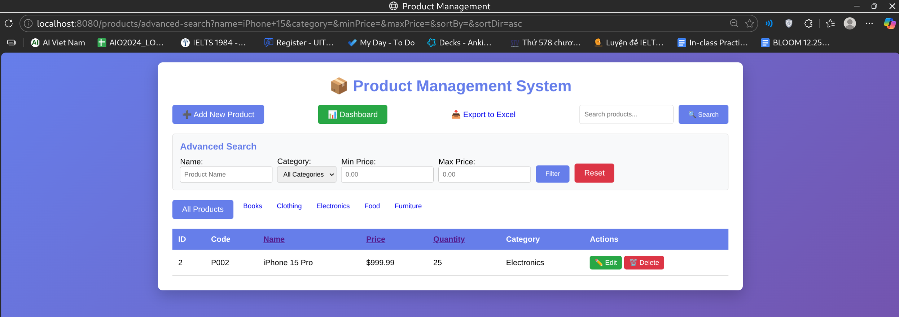
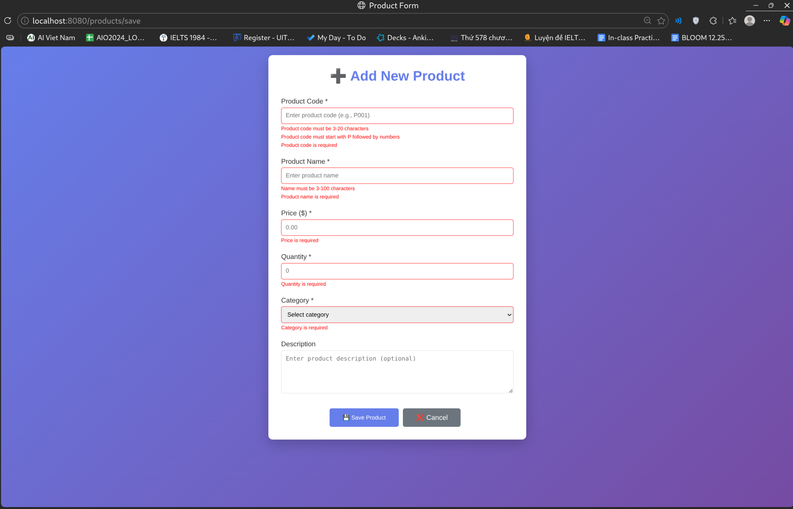
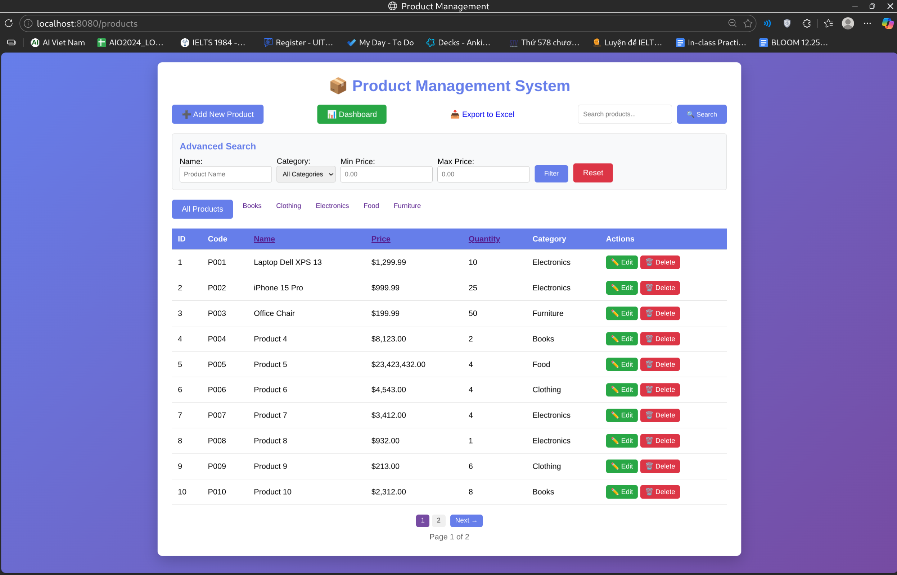
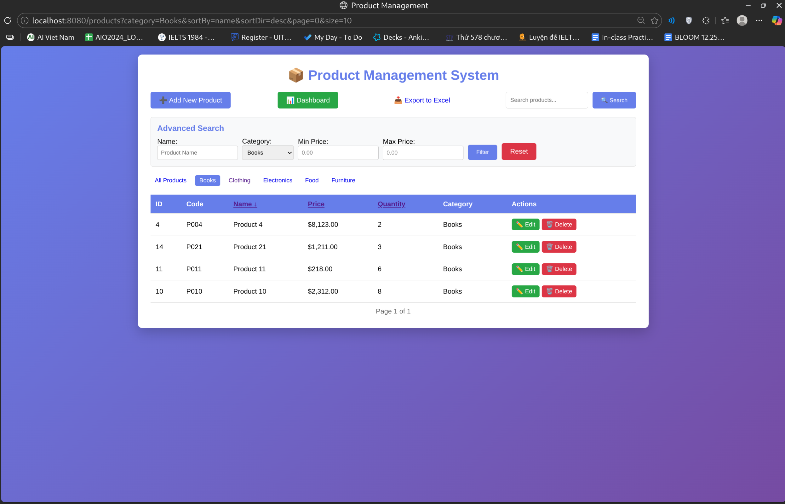
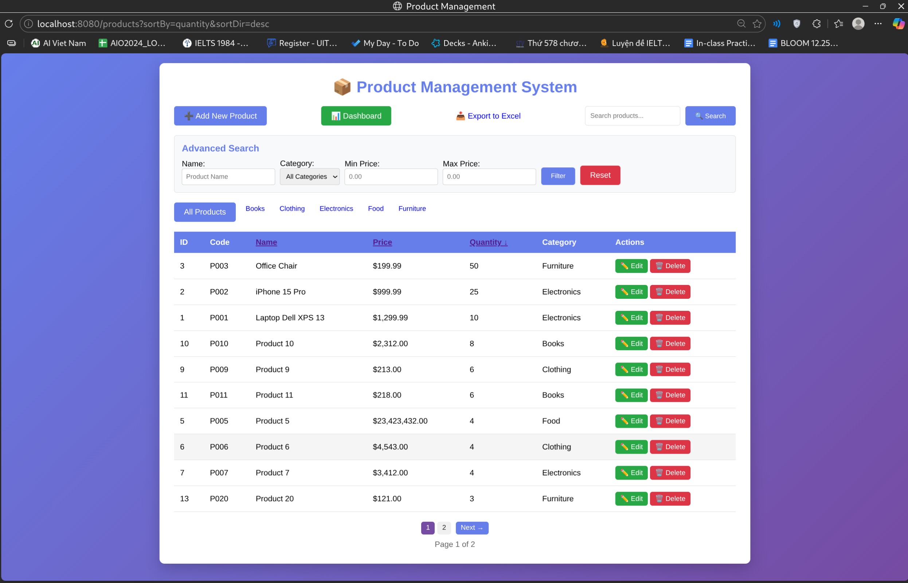
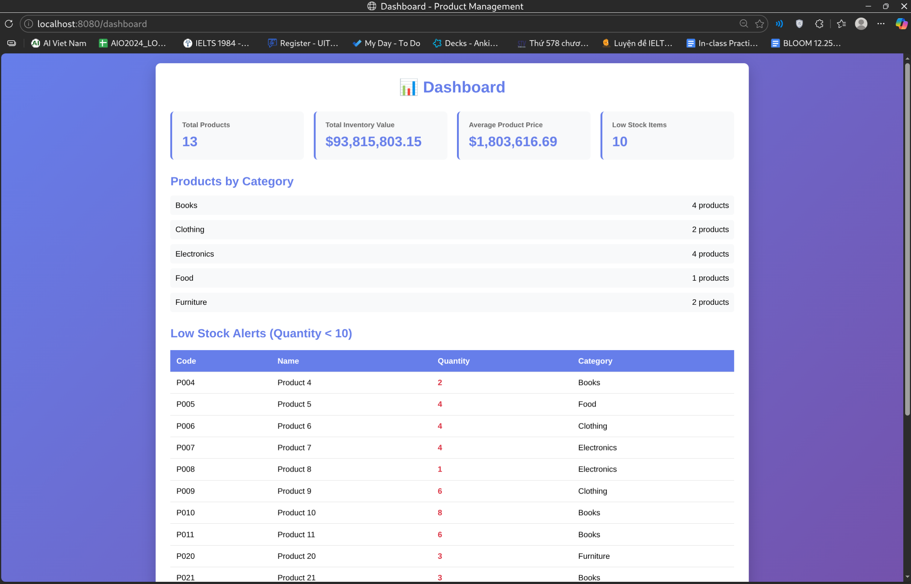
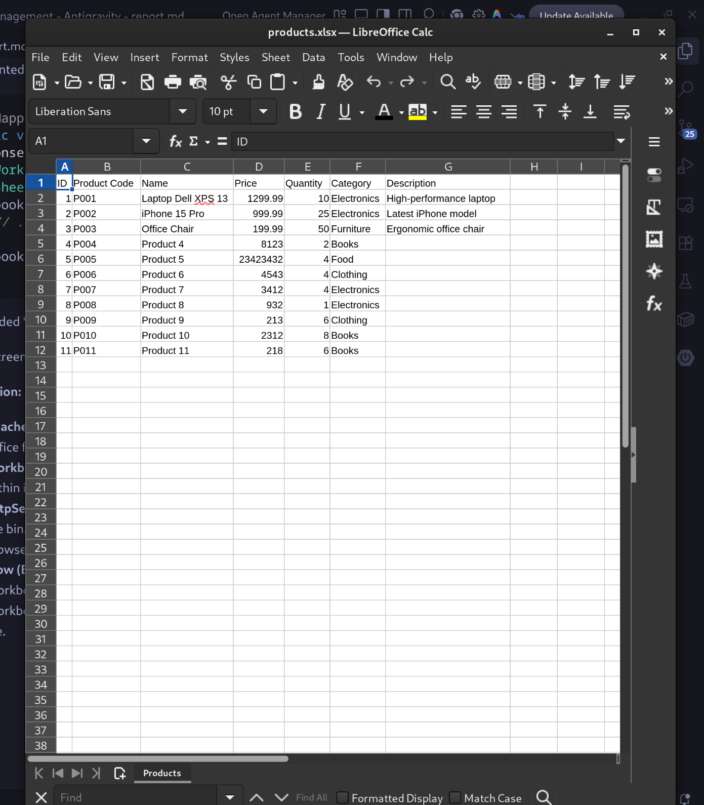

# LAB 7 HOMEWORK REPORT

## Student Information

- **Name:** Mai Long Thien
- **Student ID:** ITCSIU23059
- **Class:** ITIT23UN41

---

## PART C: HOMEWORK EXERCISES

### EXERCISE 5: ADVANCED SEARCH

#### Task 5.1: Multi-Criteria Search

**File:** `src/main/java/com/example/productmanagement/repository/ProductRepository.java`

Implemented a custom JPQL query to search products by name, category, and price range simultaneously.

```java
@Query("SELECT p FROM Product p WHERE " +
       "(:name IS NULL OR p.name LIKE %:name%) AND " +
       "(:category IS NULL OR p.category = :category) AND " +
       "(:minPrice IS NULL OR p.price >= :minPrice) AND " +
       "(:maxPrice IS NULL OR p.price <= :maxPrice)")
List<Product> searchProducts(@Param("name") String name,
                            @Param("category") String category,
                            @Param("minPrice") BigDecimal minPrice,
                            @Param("maxPrice") BigDecimal maxPrice);
```

**File:** `src/main/java/com/example/productmanagement/controller/ProductController.java`

Created an endpoint to handle advanced search requests.

```java
@GetMapping("/advanced-search")
public String advancedSearch(
        @RequestParam(required = false) String name,
        @RequestParam(required = false) String category,
        @RequestParam(required = false) BigDecimal minPrice,
        @RequestParam(required = false) BigDecimal maxPrice,
        Model model) {
    List<Product> products = productService.searchProducts(name, category, minPrice, maxPrice);
    model.addAttribute("products", products);
    return "product-list";
}
```

**View (`product-list.html`):**
Added an advanced search form with multiple input fields.

```html
<form th:action="@{/products/advanced-search}" method="get">
  <input type="text" name="name" placeholder="Product Name" />
  <select name="category">
    ...
  </select>
  <input type="number" name="minPrice" placeholder="Min Price" />
  <input type="number" name="maxPrice" placeholder="Max Price" />
  <button type="submit">Filter</button>
</form>
```



**Explanation:**

- **Custom Query:** The `@Query` annotation defines a JPQL query that handles multiple optional parameters using `IS NULL` checks.
- **Dynamic Filtering:** The query dynamically filters results based on which parameters (name, category, price range) are provided.
- **Controller Endpoint:** The `advancedSearch` method captures request parameters and passes them to the service layer.
- **Flow (Advanced Search):** User submits search form -> Controller receives params -> Service calls repository -> Repository executes custom JPQL -> Database returns filtered results -> Controller updates Model -> View displays filtered list.

### EXERCISE 6: VALIDATION & PAGINATION

#### Task 6.1: Validation

**File:** `src/main/java/com/example/productmanagement/entity/Product.java`

Added Jakarta Validation annotations to the `Product` entity to enforce data integrity.

```java
@NotBlank(message = "Product code is required")
@Size(min = 3, max = 20, message = "Product code must be 3-20 characters")
@Pattern(regexp = "^P\\d{3,}$", message = "Product code must start with P followed by numbers")
@Column(name = "product_code", unique = true, nullable = false, length = 20)
private String productCode;

@NotBlank(message = "Product name is required")
@Size(min = 3, max = 100, message = "Name must be 3-100 characters")
@Column(nullable = false, length = 100)
private String name;

@NotNull(message = "Price is required")
@DecimalMin(value = "0.01", message = "Price must be greater than 0")
@DecimalMax(value = "999999.99", message = "Price is too high")
@Column(nullable = false, precision = 10, scale = 2)
private BigDecimal price;

@NotNull(message = "Quantity is required")
@Min(value = 0, message = "Quantity cannot be negative")
@Column(nullable = false)
private Integer quantity;

@NotBlank(message = "Category is required")
@Column(length = 50)
private String category;
```

**Validation in Controller:**
Updated `ProductController` to handle validation errors.

```java
@PostMapping("/save")
public String saveProduct(@Valid @ModelAttribute("product") Product product,
                         BindingResult bindingResult,
                         Model model,
                         RedirectAttributes redirectAttributes) {
    if (bindingResult.hasErrors()) {
        model.addAttribute("categories", productService.getAllCategories());
        return "product-form";
    }
    // ... save logic
}
```

**Validation in View (`product-form.html`):**
Displayed error messages using Thymeleaf.

```html
<input type="text" th:field="*{productCode}" th:errorclass="error" />
<span
  class="error-message"
  th:if="${#fields.hasErrors('productCode')}"
  th:errors="*{productCode}"
></span>
```



**Explanation:**

- **Jakarta Validation:** Annotations like `@NotBlank`, `@Size`, `@Min` define constraints directly on the entity fields.
- **BindingResult:** Captures validation errors during the form submission process.
- **Error Handling:** The controller checks `bindingResult.hasErrors()` and returns the user to the form if validation fails.
- **Thymeleaf Integration:** The `th:errors` attribute displays specific error messages next to the corresponding form fields.
- **Flow (Validation):** User submits invalid data -> Controller detects errors in `BindingResult` -> Controller returns form view with errors -> View displays error messages.

#### Task 6.2: Pagination

**File:** `src/main/java/com/example/productmanagement/repository/ProductRepository.java`

Updated repository methods to return `Page<Product>`.

```java
Page<Product> findByNameContaining(String keyword, Pageable pageable);
```

**File:** `src/main/java/com/example/productmanagement/service/ProductServiceImpl.java`

Implemented pagination logic in the service layer.

```java
@Override
public Page<Product> searchProducts(String keyword, Pageable pageable) {
    return productRepository.findByNameContaining(keyword, pageable);
}
```

**File:** `src/main/java/com/example/productmanagement/controller/ProductController.java`

Updated controller to handle `page` and `size` parameters.

```java
@GetMapping
public String listProducts(
        @RequestParam(defaultValue = "0") int page,
        @RequestParam(defaultValue = "5") int size,
        // ... other params
        Model model) {
    Pageable pageable = PageRequest.of(page, size);
    Page<Product> productPage = productService.getAllProducts(pageable);
    model.addAttribute("products", productPage.getContent());
    model.addAttribute("currentPage", page);
    model.addAttribute("totalPages", productPage.getTotalPages());
    // ...
}
```



**Explanation:**

- **Pageable Interface:** Represents pagination information (page number, page size, sorting).
- **Page<T> Return Type:** Wraps the list of content along with pagination metadata (total pages, total elements).
- **Controller Logic:** The `listProducts` method accepts `page` and `size` parameters to create a `PageRequest`.
- **Flow (Pagination):** User clicks page number -> Controller creates `Pageable` -> Service calls `findAll(Pageable)` -> Repository returns `Page<Product>` -> Controller adds content and metadata to Model -> View renders pagination links.

---

### EXERCISE 7: SORTING & FILTERING

#### Task 7.1: Sorting

**File:** `src/main/java/com/example/productmanagement/controller/ProductController.java`

Implemented sorting logic using `Sort` object.

```java
if (sortBy != null && !sortBy.isEmpty()) {
    Sort sort = sortDir.equals("asc") ? Sort.by(sortBy).ascending() : Sort.by(sortBy).descending();
    pageable = PageRequest.of(page, size, sort);
}
```

**View (`product-list.html`):**
Added sortable headers with direction indicators.

```html
<a th:href="@{/products(sortBy='name',sortDir=${sortDir=='asc'?'desc':'asc'})}">
  Name
  <span th:if="${sortBy=='name'}" th:text="${sortDir=='asc'?'↑':'↓'}"></span>
</a>
```




#### Task 7.2: Filtering by Category

**File:** `src/main/java/com/example/productmanagement/repository/ProductRepository.java`

Added method to find products by category with pagination.

```java
Page<Product> findByCategory(String category, Pageable pageable);
```

**View (`product-list.html`):**
Added category filter buttons.

```html
<a
  th:each="cat : ${categories}"
  th:href="@{/products(category=${cat},sortBy=${sortBy},sortDir=${sortDir})}"
  th:text="${cat}"
>
</a>
```

[Insert Screenshot Here: Product list filtered by 'Electronics']

#### Task 7.3: Combined Usage

Ensured that sorting, filtering, and pagination work together by passing all parameters in links and forms.


**Explanation:**

- **Sort Object:** The `Sort` class specifies the sorting field and direction (ASC/DESC).
- **Combined Logic:** Sorting is applied to the `Pageable` object, ensuring that pagination and sorting work together.
- **Category Filtering:** The `findByCategory` method accepts a `Pageable` object, allowing filtered results to be paginated and sorted.
- **Flow (Sort & Filter):** User selects category/sort -> Controller creates `Pageable` with `Sort` -> Service calls `findByCategory` -> Repository returns sorted & filtered Page -> View updates list.

---

### EXERCISE 8: STATISTICS & DASHBOARD

#### Task 8.1: Statistics Methods

**File:** `src/main/java/com/example/productmanagement/repository/ProductRepository.java`

Added custom JPQL queries for statistics.

```java
@Query("SELECT COUNT(p) FROM Product p WHERE p.category = :category")
long countByCategory(@Param("category") String category);

@Query("SELECT SUM(p.price * p.quantity) FROM Product p")
BigDecimal calculateTotalValue();

@Query("SELECT AVG(p.price) FROM Product p")
BigDecimal calculateAveragePrice();

@Query("SELECT p FROM Product p WHERE p.quantity < :threshold")
List<Product> findLowStockProducts(@Param("threshold") int threshold);
```

#### Task 8.2: Dashboard Controller

**File:** `src/main/java/com/example/productmanagement/controller/DashboardController.java`

Created a new controller to serve the dashboard data.

```java
@GetMapping
public String showDashboard(Model model) {
    model.addAttribute("totalProducts", productService.getAllProducts().size());
    model.addAttribute("totalValue", productService.calculateTotalValue());
    model.addAttribute("averagePrice", productService.calculateAveragePrice());
    model.addAttribute("lowStockProducts", productService.findLowStockProducts(10));
    // ...
    return "dashboard";
}
```

#### Task 8.3: Dashboard View

**File:** `src/main/resources/templates/dashboard.html`

Created a dashboard page to display statistics and alerts.




**Explanation:**

- **Aggregate Queries:** JPQL queries use `COUNT`, `SUM`, and `AVG` to calculate statistics directly in the database for performance.
- **Dashboard Controller:** A dedicated controller gathers all statistical data and prepares it for the dashboard view.
- **Low Stock Logic:** A custom query identifies products with quantity below a specified threshold.
- **Flow (Dashboard):** User accesses dashboard -> Controller calls multiple service methods -> Repository executes aggregate queries -> Database returns stats -> Controller adds stats to Model -> View displays dashboard.

---

## PART D: BONUS EXERCISES

### BONUS 1: REST API (8 points)

**File:** `src/main/java/com/example/productmanagement/controller/ProductRestController.java`

Implemented a RESTful API with standard endpoints.

```java
@RestController
@RequestMapping("/api/products")
public class ProductRestController {

    @GetMapping
    public ResponseEntity<List<Product>> getAllProducts() { ... }

    @GetMapping("/{id}")
    public ResponseEntity<Product> getProduct(@PathVariable Long id) { ... }

    @PostMapping
    public ResponseEntity<Product> createProduct(@RequestBody Product product) { ... }

    // PUT and DELETE methods...
}
```


**Explanation:**

- **@RestController:** Combines `@Controller` and `@ResponseBody`, indicating that return values are written directly to the HTTP response body (usually as JSON).
- **ResponseEntity:** Represents the entire HTTP response, including status code, headers, and body.
- **CRUD Endpoints:** Standard HTTP methods (GET, POST, PUT, DELETE) map to CRUD operations.
- **Flow (REST):** Client sends HTTP request -> DispatcherServlet routes to RestController -> Service processes request -> Data returned as JSON response.

### BONUS 3: EXPORT TO EXCEL (6 points)

**File:** `src/main/java/com/example/productmanagement/controller/ExportController.java`

Implemented Excel export using Apache POI.

```java
@GetMapping("/excel")
public void exportToExcel(HttpServletResponse response) throws IOException {
    Workbook workbook = new XSSFWorkbook();
    Sheet sheet = workbook.createSheet("Products");
    // ... write rows ...
    workbook.write(response.getOutputStream());
}
```

**View:** Added "Export to Excel" button in `product-list.html`.




**Explanation:**

- **Apache POI:** A Java library used to read and write Microsoft Office file formats, including Excel (.xlsx).
- **Workbook & Sheet:** Represent the Excel file and a sheet within it.
- **HttpServletResponse:** The response object is used to write the binary data of the generated Excel file to the client's browser.
- **Flow (Export):** User clicks Export -> Controller creates Workbook -> Populates rows with product data -> Writes Workbook to Response OutputStream -> Browser downloads file.
