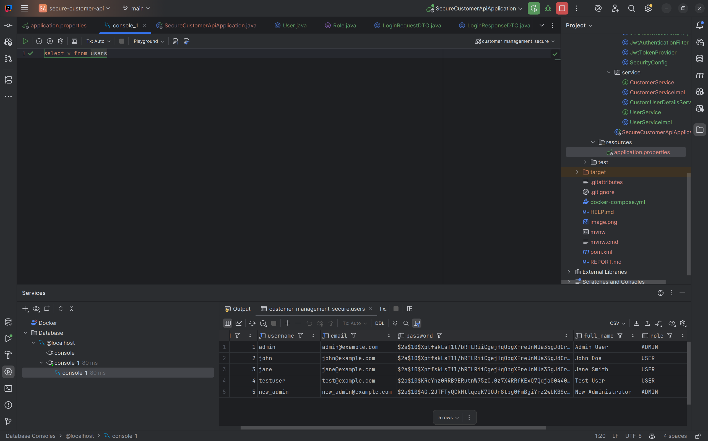
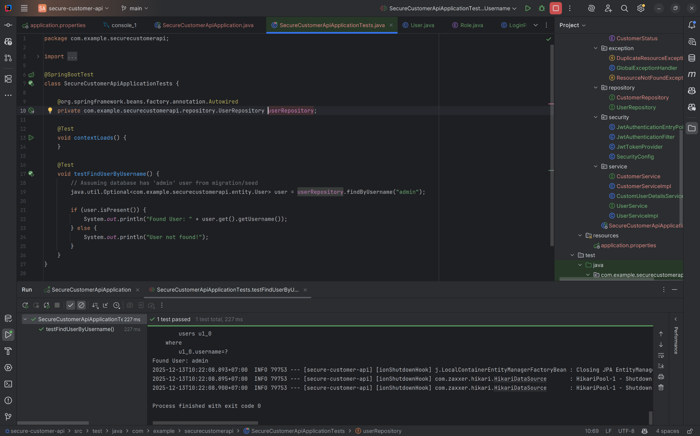
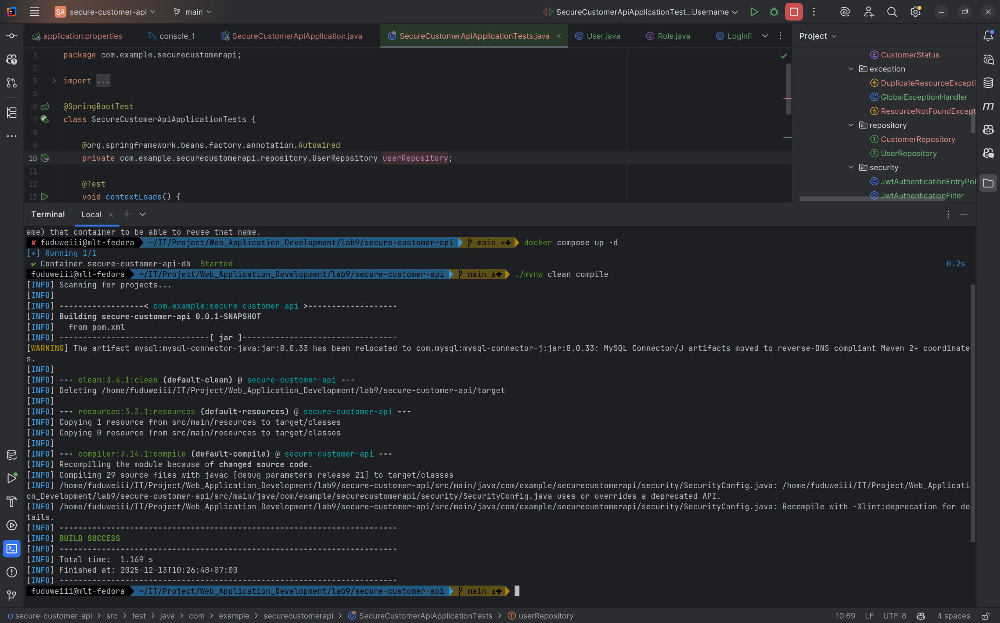
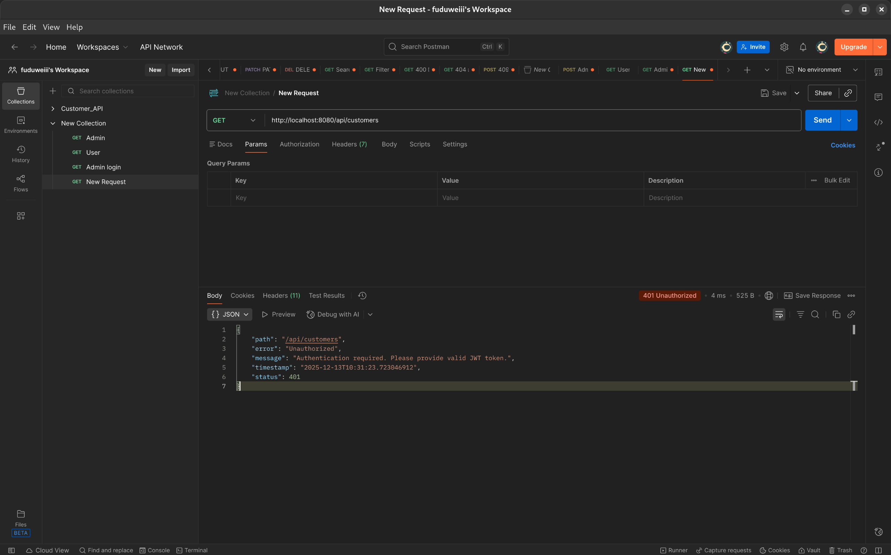
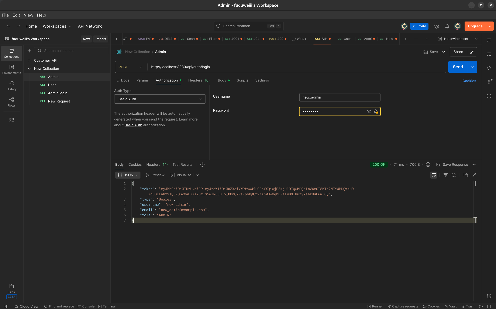

# REPORT: SECURE CUSTOMER API

## EXERCISE 1: PROJECT SETUP & USER ENTITY

### Task 1.1: Add Security Dependencies

I added the necessary dependencies for Spring Security and JWT in `pom.xml`. This allows us to use security annotations and generate tokens.

**File:** `pom.xml`

```xml
<!-- Spring Security -->
<dependency>
    <groupId>org.springframework.boot</groupId>
    <artifactId>spring-boot-starter-security</artifactId>
</dependency>

<!-- JWT Dependencies -->
<dependency>
    <groupId>io.jsonwebtoken</groupId>
    <artifactId>jjwt-api</artifactId>
    <version>0.12.3</version>
</dependency>
<dependency>
    <groupId>io.jsonwebtoken</groupId>
    <artifactId>jjwt-impl</artifactId>
    <version>0.12.3</version>
    <scope>runtime</scope>
</dependency>
<dependency>
    <groupId>io.jsonwebtoken</groupId>
    <artifactId>jjwt-jackson</artifactId>
    <version>0.12.3</version>
    <scope>runtime</scope>
</dependency>
```

### Task 1.2: Create User Entity and Role Enum

I created the `User` entity to store account information and a `Role` enum to distinguish between regular users and admins.

**File:** `src/main/java/com/example/securecustomerapi/entity/Role.java`

```java
public enum Role {
    USER,
    ADMIN
}
```

**File:** `src/main/java/com/example/securecustomerapi/entity/User.java`

```java
@Entity
@Table(name = "users")
public class User {
    @Id
    @GeneratedValue(strategy = GenerationType.IDENTITY)
    private Long id;

    @Column(unique = true, nullable = false, length = 50)
    private String username;

    @Column(nullable = false)
    private String password;

    @Enumerated(EnumType.STRING)
    @Column(nullable = false, length = 20)
    private Role role = Role.USER;

    // ... other fields and getters/setters
}
```

### Task 1.3: Database Setup

I configured the database connection and JWT settings in `application.properties`.

**File:** `src/main/resources/application.properties`

```properties
# JWT Configuration
jwt.secret=mySecretKeyForJWTTokenGenerationAndValidationMustBeLongEnough256Bits
jwt.expiration=86400000
```



---

## EXERCISE 2: DTO & REPOSITORY

### Task 2.1: Create Authentication DTOs

I created DTOs to handle login and registration requests so that we don't expose the Entity directly.

**File:** `src/main/java/com/example/securecustomerapi/dto/LoginRequestDTO.java`

```java
public class LoginRequestDTO {
    @NotBlank(message = "Username is required")
    private String username;

    @NotBlank(message = "Password is required")
    private String password;
    // ... constructors, getters, setters
}
```

**File:** `src/main/java/com/example/securecustomerapi/dto/RegisterRequestDTO.java`

```java
public class RegisterRequestDTO {
    // ... validation annotations
    private String username;
    private String email;
    private String password;
    private String fullName;
    private String role; // Search "Optional Role"
    // ... constructors, getters, setters
}
```

### Task 2.2: Create User Repository

I extended `JpaRepository` to easily query users by username or email.

**File:** `src/main/java/com/example/securecustomerapi/repository/UserRepository.java`

```java
@Repository
public interface UserRepository extends JpaRepository<User, Long> {
    Optional<User> findByUsername(String username);
    Boolean existsByUsername(String username);
    Boolean existsByEmail(String email);
}
```



---

## EXERCISE 3: JWT & SECURITY COMPONENTS

### Task 3.1: Create JWT Token Provider

This component handles the logic for generating and validating JWT tokens.

**File:** `src/main/java/com/example/securecustomerapi/security/JwtTokenProvider.java`

```java
@Component
public class JwtTokenProvider {
    // ... @Value injections

    // Generate JWT token
    public String generateToken(Authentication authentication) {
        UserDetails userDetails = (UserDetails) authentication.getPrincipal();
        Date now = new Date();
        Date expiryDate = new Date(now.getTime() + jwtExpiration);
        SecretKey key = Keys.hmacShaKeyFor(jwtSecret.getBytes(StandardCharsets.UTF_8));

        return Jwts.builder()
                .subject(userDetails.getUsername())
                .issuedAt(now)
                .expiration(expiryDate)
                .signWith(key)
                .compact();
    }

    // Validate token
    public boolean validateToken(String token) {
        try {
            SecretKey key = Keys.hmacShaKeyFor(jwtSecret.getBytes(StandardCharsets.UTF_8));
            Jwts.parser().verifyWith(key).build().parseSignedClaims(token);
            return true;
        } catch (JwtException ex) {
            // Log error
        }
        return false;
    }
}
```

### Task 3.2: Create JWT Authentication Filter

This filter checks every request for a valid "Bearer" token in the header.

**File:** `src/main/java/com/example/securecustomerapi/security/JwtAuthenticationFilter.java`

```java
@Component
public class JwtAuthenticationFilter extends OncePerRequestFilter {
    // ... dependencies

    @Override
    protected void doFilterInternal(HttpServletRequest request, HttpServletResponse response, FilterChain filterChain)
            throws ServletException, IOException {
        try {
            String jwt = getJwtFromRequest(request);

            if (StringUtils.hasText(jwt) && tokenProvider.validateToken(jwt)) {
                String username = tokenProvider.getUsernameFromToken(jwt);
                UserDetails userDetails = customUserDetailsService.loadUserByUsername(username);

                UsernamePasswordAuthenticationToken authentication =
                        new UsernamePasswordAuthenticationToken(userDetails, null, userDetails.getAuthorities());

                SecurityContextHolder.getContext().setAuthentication(authentication);
            }
        } catch (Exception ex) {
            logger.error("Could not set user authentication", ex);
        }
        filterChain.doFilter(request, response);
    }
}
```

### Task 3.3: Create Custom UserDetailsService

This service loads user data from our database and converts it to Spring Security's `UserDetails` format.

**File:** `src/main/java/com/example/securecustomerapi/service/CustomUserDetailsService.java`

```java
@Service
public class CustomUserDetailsService implements UserDetailsService {
    // ... repository injection

    @Override
    public UserDetails loadUserByUsername(String username) throws UsernameNotFoundException {
        User user = userRepository.findByUsername(username)
                .orElseThrow(() -> new UsernameNotFoundException("User not found: " + username));

        return new org.springframework.security.core.userdetails.User(
                user.getUsername(),
                user.getPassword(),
                user.getIsActive(),
                true, true, true,
                Collections.singletonList(new SimpleGrantedAuthority("ROLE_" + user.getRole().name()))
        );
    }
}
```

## 

## EXERCISE 4: SECURITY CONFIGURATION

### Task 4.1: Create Security Config

I configured the main security chain to require authentication for my API endpoints while allowing public access to login/register.

**File:** `src/main/java/com/example/securecustomerapi/security/SecurityConfig.java`

```java
@Configuration
@EnableWebSecurity
public class SecurityConfig {

    @Bean
    public SecurityFilterChain filterChain(HttpSecurity http) throws Exception {
        http
            .csrf(csrf -> csrf.disable())
            .sessionManagement(session -> session.sessionCreationPolicy(SessionCreationPolicy.STATELESS))
            .authorizeHttpRequests(auth -> auth
                .requestMatchers("/api/auth/**").permitAll()
                .requestMatchers(HttpMethod.GET, "/api/customers/**").authenticated()
                .requestMatchers(HttpMethod.POST, "/api/customers/**").hasRole("ADMIN")
                .requestMatchers(HttpMethod.PUT, "/api/customers/**").hasRole("ADMIN")
                .requestMatchers(HttpMethod.DELETE, "/api/customers/**").hasRole("ADMIN")
                .anyRequest().authenticated()
            );

        http.addFilterBefore(jwtAuthenticationFilter, UsernamePasswordAuthenticationFilter.class);
        return http.build();
    }

    @Bean
    public PasswordEncoder passwordEncoder() {
        return new BCryptPasswordEncoder();
    }
}
```

### Task 4.2: Create Authentication Entry Point

I added a custom entry point to return a clear JSON error when a user tries to access a protected resource without logging in.

**File:** `src/main/java/com/example/securecustomerapi/security/JwtAuthenticationEntryPoint.java`

```java
@Component
public class JwtAuthenticationEntryPoint implements AuthenticationEntryPoint {
    @Override
    public void commence(HttpServletRequest request, HttpServletResponse response, AuthenticationException authException)
            throws IOException {
        response.setContentType("application/json");
        response.setStatus(HttpServletResponse.SC_UNAUTHORIZED);
        // ... writes JSON map with "error": "Unauthorized"
    }
}
```



---

## EXERCISE 5: USER SERVICE & AUTH CONTROLLER

### Task 5.1: Implement User Service

I implemented the business logic for registering and logging in users.

**File:** `src/main/java/com/example/securecustomerapi/service/UserServiceImpl.java`

```java
@Service
public class UserServiceImpl implements UserService {
    // ...
    @Override
    public LoginResponseDTO login(LoginRequestDTO loginRequest) {
        Authentication authentication = authenticationManager.authenticate(
                new UsernamePasswordAuthenticationToken(loginRequest.getUsername(), loginRequest.getPassword()));

        SecurityContextHolder.getContext().setAuthentication(authentication);
        String token = tokenProvider.generateToken(authentication);
        // ... return DTO
    }
}
```

### Task 5.2: Create Auth Controller

I checked the endpoints to expose the authentication logic.

**File:** `src/main/java/com/example/securecustomerapi/controller/AuthController.java`

```java
@RestController
@RequestMapping("/api/auth")
public class AuthController {

    @PostMapping("/login")
    public ResponseEntity<LoginResponseDTO> login(@Valid @RequestBody LoginRequestDTO loginRequest) {
        return ResponseEntity.ok(userService.login(loginRequest));
    }

    @PostMapping("/register")
    public ResponseEntity<UserResponseDTO> register(@Valid @RequestBody RegisterRequestDTO registerRequest) {
        return ResponseEntity.status(HttpStatus.CREATED).body(userService.register(registerRequest));
    }
}
```

### Task 5.3: Update Customer Controller

I secured the customer creation/update endpoints so only Admins can use them.

**File:** `src/main/java/com/example/securecustomerapi/controller/CustomerRestController.java`

```java
@RestController
@RequestMapping("/api/customers")
public class CustomerRestController {

    @PostMapping
    @PreAuthorize("hasRole('ADMIN')") // Only ADMIN
    public ResponseEntity<CustomerResponseDTO> createCustomer(@Valid @RequestBody CustomerRequestDTO requestDTO) {
        // ...
    }
}
```

**Test login with username/password**


Status: 200 OK

**Test login with token**


Status: 200 Ok

---

## AUTHENTICATION FLOW

### 1. Login Flow (Getting the Token)

When a user calls `POST /api/auth/login` with their username and password:

1.  **AuthController** receives the request and calls `userService.login()`.
2.  **UserService** calls `AuthenticationManager.authenticate()`.
3.  **AuthenticationManager** uses **CustomUserDetailsService** to load the user from the database and verify the password (using BCrypt).
4.  If the password is correct, **UserService** calls **JwtTokenProvider** to generate a signed JWT (containing the username).
5.  The token is returned to the user in the response.

### 2. Authenticated Request Flow (Using the Token)

When a user calls `GET /api/customers` with the header `Authorization: Bearer <token>`:

1.  **JwtAuthenticationFilter** intercepts the request before it reaches the Controller.
2.  It extracts the token from the header and uses **JwtTokenProvider** to validate it.
3.  If valid, it extracts the username and loads the user details via **CustomUserDetailsService**.
4.  It creates an **Authentication** object and saves it to the **SecurityContext**.
5.  **SecurityConfig** checks if the standard user is allowed to access the endpoint.
6.  The request finally reaches **CustomerRestController** and returns the data.
